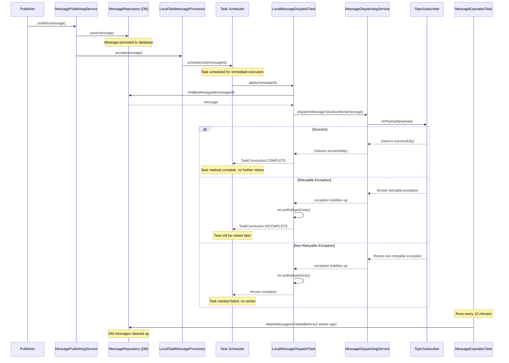

# Incept5 Messaging Library - Event Lifecycle Developer Guide

## Overview

The Incept5 Messaging Library provides a complete event-driven messaging system with persistent storage, automatic retry mechanisms, and transaction safety. This guide explains the complete lifecycle of events from publishing to successful processing, including how messages are created, processed, marked as complete, and eventually cleaned up.

## Event Lifecycle Overview

The event lifecycle in the Incept5 Messaging Library follows this sequence:



## 1. Message Publishing Phase

### 1.1 Publishing Process

When you publish a message, several things happen in sequence:

```kotlin
@ApplicationScoped
class OrderService(val messagePublisher: MessagePublisher) {
    
    fun processOrder(order: Order) {
        // 1. Create and publish message
        messagePublisher.publish("order-processing", OrderPayload(order.id, order.total))
        // At this point, message is persisted and scheduled for processing
    }
}
```

**What happens during `publish()`:**

1. **Message Creation**: The payload is serialized to JSON and wrapped in a `Message` object with:
   - Unique `messageId` (UUID)
   - Current timestamp (`createdAt`)
   - Topic name
   - Correlation ID for tracing
   - Payload JSON and type information

2. **Persistence**: Message is immediately saved to the database via `MessageRepository.save()`

3. **Local Processing Check**: `LocalTaskMessageProcessor` checks if there are local subscribers for this topic

4. **Task Scheduling**: If subscribers exist, a `LocalMessageDispatchTask` is scheduled with the message ID

### 1.2 Database Schema

Messages are stored in the `messages` table:

```sql
CREATE TABLE messages (
  topic text NOT NULL,
  payload_json text NOT NULL,
  type text NOT NULL,
  message_id uuid NOT NULL PRIMARY KEY,
  created_at timestamp with time zone NOT NULL DEFAULT CURRENT_TIMESTAMP,
  correlation_id text NOT NULL,
  trace_id text NOT NULL,
  reply_to text
);
```

**Key Points:**
- Messages are **immediately persisted** when published
- **No processing state tracking** in the message table itself
- Message processing state is managed by the task scheduler
- Messages remain in database until cleanup (default: 2 weeks)

## 2. Message Processing Phase

### 2.1 Task Execution

The `LocalMessageDispatchTask` handles message processing:

```kotlin
@Transactional
override fun apply(context: TaskContext<UUID>): TaskConclusion {
    try {
        // 1. Fetch message from database
        val message = messageFinder.findByMessageId(context.payload)
        
        // 2. Dispatch to all matching subscribers
        dispatcher.dispatchMessageToSubscribers(message)
        
        // 3. If no exceptions, processing succeeded
        return TaskConclusion.COMPLETE
        
    } catch (e: Exception) {
        // 4. Handle exceptions based on retry classification
        if (e.isRetryable()) {
            tm.setRollbackOnly()  // Rollback any database changes
            return TaskConclusion.INCOMPLETE  // Will retry
        } else {
            tm.setRollbackOnly()  // Rollback any database changes
            throw e  // Permanent failure
        }
    }
}
```

### 2.2 Subscriber Processing

Your subscribers receive the processed message:

```kotlin
@ApplicationScoped
class OrderProcessingSubscriber : TopicSubscriber<OrderPayload>("order-processing", OrderPayload::class) {
    
    override fun onPayload(payload: OrderPayload) {
        // Your business logic here
        processOrder(payload.orderId)
        
        // If this method returns without exception:
        // - Processing is considered successful
        // - Task will be marked COMPLETE
        // - No further retries will occur
    }
}
```

## 3. Success vs Failure Outcomes

### 3.1 Successful Processing

**When processing succeeds:**
1. Subscriber's `onPayload()` returns without throwing an exception
2. Transaction commits successfully
3. Task is marked as `TaskConclusion.COMPLETE`
4. No further processing attempts are made
5. Message remains in database for audit/recovery purposes until cleanup

**Example:**
```kotlin
@ApplicationScoped
class PaymentProcessor : TopicSubscriber<PaymentPayload>("payments", PaymentPayload::class) {
    
    @Inject
    lateinit var paymentService: PaymentService
    
    override fun onPayload(payload: PaymentPayload) {
        paymentService.processPayment(payload.paymentId, payload.amount)
        // Success - no exception thrown
        // Task will be marked COMPLETE
        // Message processing is finished
    }
}
```

### 3.2 Retry Scenarios (Retryable Exceptions)

**When retryable exceptions occur:**
1. Exception is classified as retryable via `exception.isRetryable()`
2. Current transaction is rolled back (`tm.setRollbackOnly()`)
3. Task returns `TaskConclusion.INCOMPLETE`
4. Task scheduler will retry based on exponential backoff configuration
5. Message is re-fetched from database and processing is attempted again

**Example:**
```kotlin
@ApplicationScoped
class EmailNotificationSubscriber : TopicSubscriber<EmailPayload>("email-notifications", EmailPayload::class) {
    
    override fun onPayload(payload: EmailPayload) {
        try {
            emailService.send(payload.to, payload.subject, payload.body)
        } catch (e: EmailServiceUnavailableException) {
            // This will cause retry
            throw e.addMetadata(
                ErrorCategory.INFRASTRUCTURE,
                Error("email-service-unavailable"),
                retryable = true
            )
            // Task will return INCOMPLETE and retry later
        }
    }
}
```

### 3.3 Permanent Failures (Non-Retryable Exceptions)

**When non-retryable exceptions occur:**
1. Exception is classified as non-retryable
2. Current transaction is rolled back
3. Exception is re-thrown, causing task to fail permanently
4. No further retries will be attempted
5. Task is marked as failed in the scheduler

**Example:**
```kotlin
@ApplicationScoped
class OrderValidationSubscriber : TopicSubscriber<OrderPayload>("order-validation", OrderPayload::class) {
    
    override fun onPayload(payload: OrderPayload) {
        if (payload.amount <= 0) {
            // This should NOT retry - permanent validation error
            throw IllegalArgumentException("Order amount must be positive").addMetadata(
                ErrorCategory.VALIDATION,
                Error("invalid-order-amount")
                // retryable = false (default)
            )
            // Task will fail permanently, no retries
        }
    }
}
```

## 4. Message Cleanup and Expiration

### 4.1 Automatic Message Expiration

The `LocalMessageExpirationTask` runs automatically to prevent database bloat:

**Default Behavior:**
- Runs every **10 minutes**
- Deletes messages older than **2 weeks**
- Configurable via `messaging.expire-messages-after` property

**Configuration Example:**
```yaml
messaging:
  expire-messages-after: P7D  # Keep messages for 7 days instead of 14
```

### 4.2 Why Messages Aren't Deleted Immediately

Messages are **NOT** deleted immediately after successful processing for several important reasons:

1. **Audit Trail**: Keep record of what messages were processed
2. **Debugging**: Ability to investigate issues that occur after processing
3. **Replay Capability**: Can potentially replay messages if needed
4. **Idempotency Checks**: Subscribers can check if they've already processed a message
5. **Disaster Recovery**: Messages remain available if processing state is lost

## 5. Implementing Idempotency

Since messages remain in the database and retries can occur, implementing idempotency is crucial:

### 5.1 Database-Based Idempotency

```kotlin
@ApplicationScoped
class OrderFulfillmentSubscriber : TopicSubscriber<OrderPayload>("order-fulfillment", OrderPayload::class) {
    
    @Inject
    lateinit var fulfillmentRepository: FulfillmentRepository
    
    override fun onPayload(payload: OrderPayload) {
        // Check if already processed using message ID
        val messageId = getCurrentMessageId() // You'll need to implement this
        
        if (fulfillmentRepository.existsByMessageId(messageId)) {
            logger.info("Order ${payload.orderId} already fulfilled for message ${messageId}")
            return // Skip processing - already done
        }
        
        // Process the order
        val fulfillment = fulfillOrder(payload)
        
        // Record that we processed this message
        fulfillmentRepository.save(fulfillment.copy(messageId = messageId))
    }
}
```

### 5.2 Business Logic Idempotency

```kotlin
@ApplicationScoped
class AccountBalanceUpdater : TopicSubscriber<BalancePayload>("balance-updates", BalancePayload::class) {
    
    override fun onPayload(payload: BalancePayload) {
        // Use business logic to ensure idempotency
        val account = accountRepository.findById(payload.accountId)
        
        // Check if this specific transaction was already applied
        if (account.transactions.any { it.transactionId == payload.transactionId }) {
            logger.info("Transaction ${payload.transactionId} already applied")
            return
        }
        
        // Apply the balance change
        val updatedAccount = account.copy(
            balance = account.balance + payload.amount,
            transactions = account.transactions + Transaction(
                transactionId = payload.transactionId,
                amount = payload.amount,
                appliedAt = Instant.now()
            )
        )
        
        accountRepository.save(updatedAccount)
    }
}
```

### 5.3 Using Message Properties for Idempotency

```kotlin
@ApplicationScoped
class NotificationSender : TopicSubscriber<NotificationPayload>("notifications", NotificationPayload::class) {
    
    override fun onPayload(payload: NotificationPayload) {
        // Use correlation ID or custom idempotency key
        val idempotencyKey = payload.idempotencyKey ?: getCurrentCorrelationId()
        
        if (notificationRepository.existsByIdempotencyKey(idempotencyKey)) {
            logger.info("Notification already sent for key: $idempotencyKey")
            return
        }
        
        // Send notification
        notificationService.send(payload.recipient, payload.message)
        
        // Record that we sent it
        notificationRepository.save(NotificationRecord(
            idempotencyKey = idempotencyKey,
            recipient = payload.recipient,
            sentAt = Instant.now()
        ))
    }
}
```

## 6. Advanced Processing Patterns

### 6.1 Checking Message Processing Status

Since messages remain in the database, you can query processing status:

```kotlin
@ApplicationScoped
class MessageStatusService(
    val messageRepository: MessageRepository,
    val taskScheduler: TaskScheduler  // Hypothetical - implementation specific
) {
    
    fun getMessageStatus(messageId: UUID): MessageStatus {
        val message = messageRepository.findByMessageId(messageId)
            ?: return MessageStatus.NOT_FOUND
        
        // Check if task is still scheduled/running
        val taskStatus = taskScheduler.getTaskStatus("local-message-dispatch-task", messageId)
        
        return when (taskStatus) {
            TaskState.SCHEDULED -> MessageStatus.PENDING
            TaskState.RUNNING -> MessageStatus.PROCESSING
            TaskState.COMPLETE -> MessageStatus.PROCESSED
            TaskState.FAILED -> MessageStatus.FAILED
            TaskState.RETRYING -> MessageStatus.RETRYING
            else -> MessageStatus.UNKNOWN
        }
    }
}

enum class MessageStatus {
    NOT_FOUND,
    PENDING,
    PROCESSING,
    PROCESSED,
    FAILED,
    RETRYING,
    UNKNOWN
}
```

### 6.2 Manual Message Replay

You can implement manual message replay for recovery scenarios:

```kotlin
@ApplicationScoped
class MessageReplayService(
    val messageRepository: MessageRepository,
    val localDispatchTask: LocalMessageDispatchTask
) {
    
    fun replayMessage(messageId: UUID) {
        val message = messageRepository.findByMessageId(messageId)
            ?: throw IllegalArgumentException("Message not found: $messageId")
        
        // Schedule task to reprocess the message
        localDispatchTask.scheduleJob(messageId)
        
        logger.info("Scheduled replay for message: $messageId")
    }
    
    fun replayMessagesInTimeRange(from: Instant, to: Instant, topic: String? = null) {
        val messages = if (topic != null) {
            messageRepository.findByTopicAndCreatedAtBetween(topic, from, to)
        } else {
            messageRepository.findByCreatedAtBetween(from, to)
        }
        
        messages.forEach { message ->
            message.messageId?.let { localDispatchTask.scheduleJob(it) }
        }
        
        logger.info("Scheduled replay for ${messages.size} messages")
    }
}
```

## 7. Configuration and Tuning

### 7.1 Message Expiration Configuration

```yaml
messaging:
  expire-messages-after: P7D  # ISO 8601 duration - 7 days
  
# Alternative examples:
# expire-messages-after: PT24H    # 24 hours
# expire-messages-after: P30D     # 30 days  
# expire-messages-after: PT6H     # 6 hours
```

### 7.2 Cleanup Task Frequency

```yaml
task:
  scheduler:
    tasks:
      local-message-expiration-task:
        frequency:
          recurs: PT5M  # Run every 5 minutes instead of 10
```

### 7.3 Database Performance Tuning

For high-volume messaging systems, consider these database optimizations:

```sql
-- Add index on created_at for efficient cleanup
CREATE INDEX IF NOT EXISTS idx_messages_created_at 
ON messages (created_at);

-- Add index on topic for efficient querying
CREATE INDEX IF NOT EXISTS idx_messages_topic 
ON messages (topic);

-- Add composite index for topic-based time range queries
CREATE INDEX IF NOT EXISTS idx_messages_topic_created_at 
ON messages (topic, created_at);
```

## 8. Monitoring and Observability

### 8.1 Key Metrics to Track

```kotlin
@ApplicationScoped
class MessagingMetrics {
    
    private val publishedCounter = Counter.builder("messages_published_total")
        .description("Total messages published")
        .register(Metrics.globalRegistry)
    
    private val processedCounter = Counter.builder("messages_processed_total")
        .description("Total messages processed successfully")
        .register(Metrics.globalRegistry)
    
    private val failedCounter = Counter.builder("messages_failed_total")
        .description("Total messages that failed permanently")
        .register(Metrics.globalRegistry)
    
    private val retryCounter = Counter.builder("messages_retried_total")
        .description("Total message retry attempts")
        .register(Metrics.globalRegistry)
    
    private val processingTime = Timer.builder("message_processing_duration")
        .description("Time taken to process messages")
        .register(Metrics.globalRegistry)
    
    private val databaseSize = Gauge.builder("messages_database_count")
        .description("Number of messages in database")
        .register(Metrics.globalRegistry) { -> getMessageCount() }
}
```

### 8.2 Health Checks

```kotlin
@ApplicationScoped
class MessagingHealthCheck {
    
    fun checkMessageProcessingHealth(): HealthStatus {
        val oldestUnprocessedMessage = findOldestUnprocessedMessage()
        
        return if (oldestUnprocessedMessage != null && 
                  Duration.between(oldestUnprocessedMessage.createdAt, Instant.now()) 
                    > Duration.ofMinutes(30)) {
            HealthStatus.UNHEALTHY("Old unprocessed messages detected")
        } else {
            HealthStatus.HEALTHY
        }
    }
    
    fun checkDatabaseGrowth(): HealthStatus {
        val messageCount = messageRepository.count()
        val threshold = 1_000_000 // 1 million messages
        
        return if (messageCount > threshold) {
            HealthStatus.UNHEALTHY("Message database growing too large: $messageCount")
        } else {
            HealthStatus.HEALTHY
        }
    }
}
```

## 9. Best Practices Summary

### 9.1 Design Principles

1. **Idempotent Processing**: Always design subscribers to handle duplicate processing
2. **Graceful Degradation**: Use retryable exceptions for transient failures only
3. **Audit Trails**: Leverage the fact that messages persist for debugging and auditing
4. **Resource Management**: Monitor database growth and adjust cleanup schedules accordingly
5. **Error Classification**: Carefully distinguish between retryable and non-retryable errors

### 9.2 Performance Considerations

1. **Database Indexing**: Add appropriate indexes for time-based queries
2. **Cleanup Scheduling**: Balance storage costs with audit requirements
3. **Transaction Scope**: Keep subscriber processing transactions as short as possible
4. **Batch Processing**: For high-volume scenarios, consider batch message processing
5. **Connection Pooling**: Ensure adequate database connection pooling

### 9.3 Operational Excellence

1. **Monitoring**: Track message processing metrics and database growth
2. **Alerting**: Set up alerts for processing delays and failures
3. **Documentation**: Document your topic schemas and processing expectations
4. **Testing**: Test both success and failure scenarios, including retries
5. **Deployment**: Plan for zero-downtime deployments with message processing

## Conclusion

The Incept5 Messaging Library provides a robust event lifecycle with:

- **Immediate Persistence**: Messages are saved before any processing
- **Reliable Processing**: Automatic retries with exponential backoff for transient failures
- **Transaction Safety**: Automatic rollback on processing failures
- **Audit Capability**: Messages remain available for investigation and replay
- **Automatic Cleanup**: Configurable message expiration prevents database bloat
- **Flexible Configuration**: Tunable retry policies and cleanup schedules

By understanding this lifecycle and implementing proper idempotency patterns, you can build resilient event-driven systems that gracefully handle failures while maintaining data consistency and providing excellent observability.
